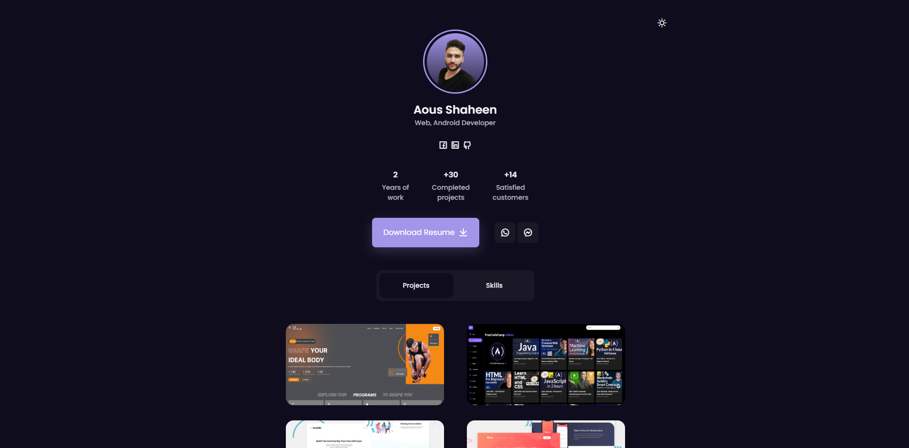

# 💼 Responsive Mini Portfolio

## Welcome! 👋

### Links

- Solution URL: [Github](https://github.com/Shaheen121/mini-portfolio-light-dark-mode.git)
- Live Site URL: [Live Site](https://aousshaheen.netlify.app/)

### Built with

- Responsive mini portfolio website Using HTML CSS & JavaScript
- Contains animations css.
- Includes a light and dark mode.
- Developed first with the Mobile First methodology, then for desktop.
- Compatible with all mobile devices and with a beautiful and pleasant user interface.

## Author

- Linkedin - [@aous-shaheen-381636221](https://www.linkedin.com/in/aous-shaheen-381636221/)
- Facebook - [@aoushaheen7](https://www.facebook.com/shaheen7tl/)

By me 🚀🚀🚀
Aous Shaheen